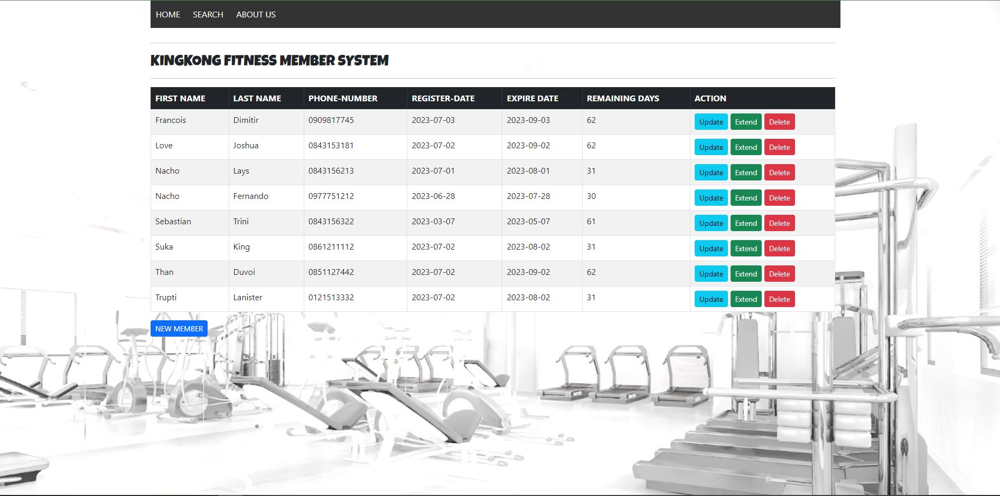

# Spring_CRUD_webAPP
  I aim to build a CRUD (Create, Read, Update, Delete) application. This application will enable me to explore and apply my skills in Java programming and MySQL. By implementing CRUD functionality, I can gain hands-on experience in manipulating data and performing essential database operations. 
  This project will serve as an excellent opportunity to deepen my understanding of both Spring Framework and database management with MySQL.
  
    
      
        
       
  

